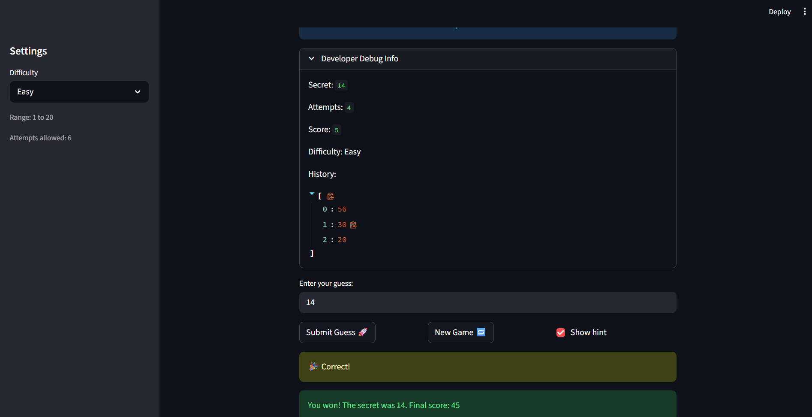

# 🎮 Game Glitch Investigator: The Impossible Guesser

## 🚨 The Situation

You asked an AI to build a simple "Number Guessing Game" using Streamlit.
It wrote the code, ran away, and now the game is unplayable. 

- You can't win.
- The hints lie to you.
- The secret number seems to have commitment issues.

## 🛠️ Setup

1. Install dependencies: `pip install -r requirements.txt`
2. Run the broken app: `python -m streamlit run app.py`

## 🕵️‍♂️ Your Mission

1. **Play the game.** Open the "Developer Debug Info" tab in the app to see the secret number. Try to win.
2. **Find the State Bug.** Why does the secret number change every time you click "Submit"? Ask ChatGPT: *"How do I keep a variable from resetting in Streamlit when I click a button?"*
3. **Fix the Logic.** The hints ("Higher/Lower") are wrong. Fix them.
4. **Refactor & Test.** - Move the logic into `logic_utils.py`.
   - Run `pytest` in your terminal.
   - Keep fixing until all tests pass!

## 📝 Document Your Experience

- The game is a number-guessing challenge where you try to guess a secret number (within a difficulty-based range) using higher/lower hints.
- I found and fixed several bugs in the game: the secret number was resetting on each rerun because state wasn’t stored properly, the higher/lower hints were being compared as strings (so “5” could be treated as greater than “10”), submitting an invalid guess still counted as an attempt (making it feel like you had to click twice), and the “New Game” button didn’t reset the game state (status/score/history), so you couldn’t actually play again after winning or losing.
- Fixed the state bug by relying on Streamlit's `st.session_state` to persist the secret number across reruns. Removed the string conversion in `check_guess` that was causing incorrect higher/lower comparisons (e.g., "5" > "10"), ensuring both guess and secret remain integers for correct numerical comparison. Moved attempt increment to only happen after a valid guess is parsed, eliminating the double-click behavior. Updated the "New Game" button to fully reset all game state (`status`, `score`, `history`, `attempts`, `secret`), allowing players to replay after winning or losing. Refactored all game logic into `logic_utils.py` and verified fixes with unit tests.

## 📸 Demo

- []

## 🚀 Stretch Features

- [ ] [If you choose to complete Challenge 4, insert a screenshot of your Enhanced Game UI here]
